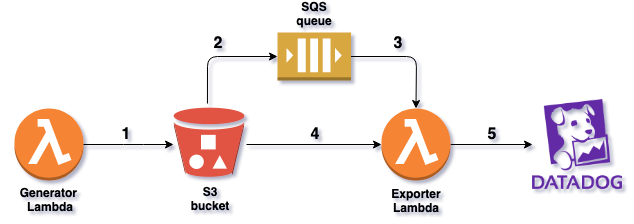
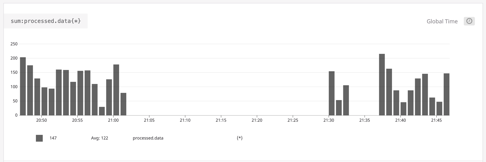

# DataDog - AWS integration project

This is a small PoC project that integrates AWS Lambda with Datadog. The basic idea is that some service or job running in the cloud will save a JSON file to a certain S3 bucket, which contains statistics about the job itself. This file should be parsed and the relevant metrics forwarded to DataDog to display in graphs (and possibly alert on anomalies).

This project has two AWS lambda functions working together: one generates and stores fake statistics to the chosen bucket, the other picks up and submits the contained metrics to DataDog via its API.

## Architecture overview



Brief description of each step in the above figure:

* 1 - CW scheduled function to generate random metric data, and store it as JSON file in S3 bucket.
* 2 - Bucket notification set up to forward message to SQS queue about newly created JSON file.
* 3 - Lambda function is triggered on new message in the SQS queue.
* 4 - Lambda function fetches the referenced file from S3 bucket.
* 5 - JSON file parsed and metrics uploaded to DataDog API.

## Setup procedure

The project is set up to use Terraform for deploying to AWS. For this reason one needs to set up the proper credentials in `~/.aws/credentials` to be able to execute the `terraform apply`.

### Step 1: Python dependencies

Since the project relies on the `datadog` python package to submit metrics via the DataDog API, we will need to package the dependency with the source code. To do this follow the below code snippet:

```bash
# For the DataDog Metric Submit function
pip install --target ./package datadog
cd package
zip -r9 ${OLDPWD}/ddg_metric_submit.zip .
cd $OLDPWD
zip -g ddg_metric_submit.zip ddg_metric_submit.py

# For the Mock Data source generator
zip ddg_mock_datasource.zip ddg_mock_datasource.py
```

A simple bash script containing the same steps can be found in the repe as well: `zipper.sh`.

### Terraform deployment

In order to deploy the project to AWS, execute the following in the root directory of the repo:

```bash
terraform init
terraform apply -var 'ddg_api_key=X...X' -var 'ddg_app_key=X...X'
```

The two CLI arguments are necessary inputs for `main.tf`. They are needed to set API/APP keys for DataDog as ENVIRONMENT variables for the metric_submit AWS Lambda function. This way there is no need to hardcode any API key into the source-code itself (which would be dangerous anyway on a public repository).

### Terraform un-deploy

Execute the below command:

```bash
terraform destroy -var 'ddg_api_key=X...X' -var 'ddg_app_key=X...X'
```

For some reason the destroy expects the same inputs as the apply command did, although the resources for which the inputs were needed are being destroyed... Never mind.

## DataDog

The file being generated and uploaded to S3 contains simple metrics which are uploaded to DataDog. Sample file includes JSON such as:

```json
{
  "timestamp" :      1575839011,
  "sample.stats" :   1231,
  "processed.data" : 321
}
```

The resulting dashboard can be set up to visualize the flow of this metric over time as such:


